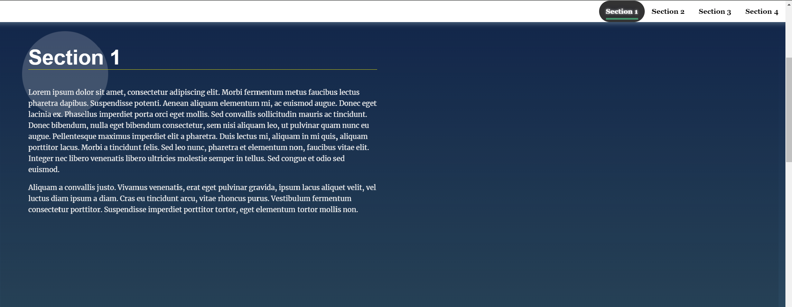

# Landing Page Project

In this project, I will write code across a handful of HTML and CSS files to create a personal blog website.

## Instructions

The starter project has some HTML and CSS styling to display a static version of the Landing Page project. You'll need to convert this project from a static project to an interactive one. This will require modifying the HTML and CSS files, but primarily the JavaScript file.

To get started, download the landing-page starter code and open `js/app.js` and start building out the app's functionality

For specific, detailed instructions, look at the project instructions in the Udacity Classroom.

## Created the Landing Page

- Create functions in app.js
- Update css file
- Update html file

## Project rubic

- The project will be based on Udacity rubics
- The project does not need additional dependencies to run.
- - https://review.udacity.com/#!/rubrics/2667/view
- - https://github.com/udacity/cd0428-landing-page/

## Project Tree

- The user does not need special tools to view the project. The project utilizes imported Google fonts that may not display if the user has not installed the fonts or does not have an internet connection.
- The project used false links and hyperlinks as placements for the project.

  - styles.css  
    index.html
    js
  - app.js
  - README.md

  

